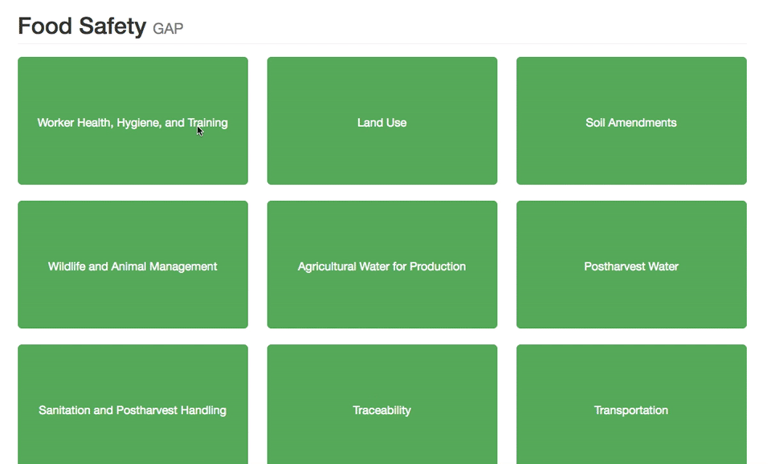

# Food Safety Wizard

The website is live [here](http://kaira.one/food_safety_gap)

A project for [Agrilyst](http://agrilyst.com/).

Cornell University's College of Agriculture and Life Sciences provide a graphic run down of GAPs (National Good Agricultural Practices) food safety protocols. Through GAP, growers are educated preventetive measures that reduce the risk of spreading microbial infection in fruits and vegetables. I extracted the [decision trees](http://www.gaps.cornell.edu/tree.html) and used it to display a wizard following Cornell's logic.

